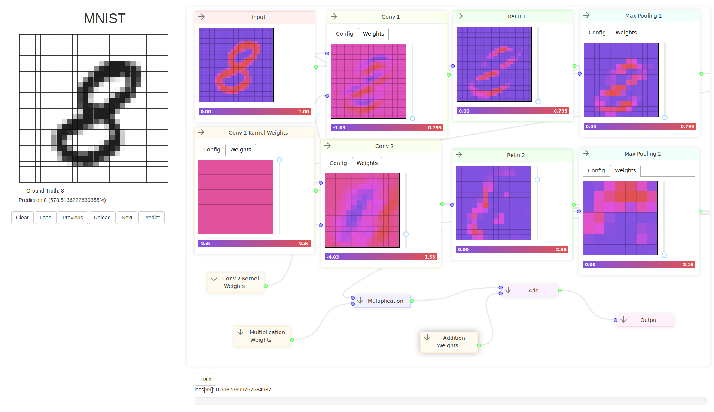

[](https://github.com/lochbrunner/open-go-bot/issues)

# A platform for designing, training and sharing AI models

Allows to design deep-learnings models for various problems, training them in the browser and sharing them with others.

This project is still work in progress. That means some important features are still missing:

* Introspection of hidden units
* Editing graphs
* Deployment to AWS
* OpenAuth integration
* Upload models (inclusive weights)
* Generic architecture in order to support multiple scenarios

## Scenarios

### MNIST

A large database of handwritten digits that is commonly used for training various image processing systems.



### Go

An abstract strategy board game for two players, in which the aim is to surround more territory than the opponent. Coming soon!

The aim of this scenario is to create a little go bot with [TensorFlow.js](https://github.com/tensorflow/tfjs) and live debugging possibility.


To install the dependencies run

```sh
yarn download-training-data
```

This script downloads and extracts the latest *sgf* files from [badukmovies.com](https://badukmovies.com/pro_games/download)

### Ant

A simulation of an ant colony. Model the brain of each individual ant like in serious games. Coming soon!

## Prerequisites

Make sure you have [nodejs](https://nodejs.org/en/) and optional [yarn](https://yarnpkg.com/en/) installed.

## Installation

Run

```sh
yarn install
```
